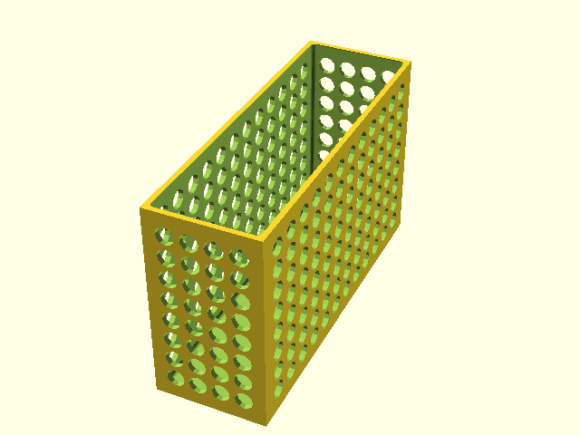
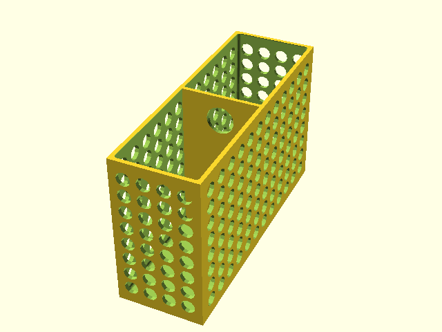
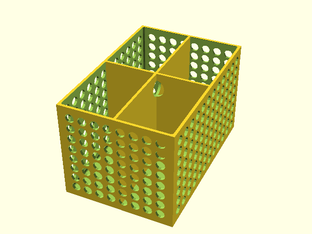
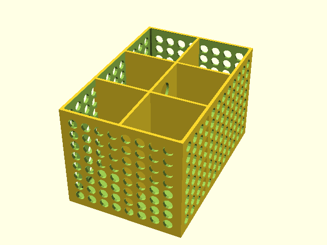
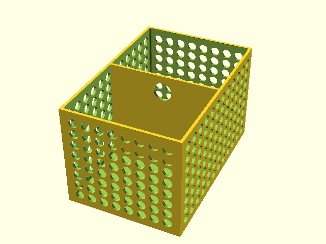
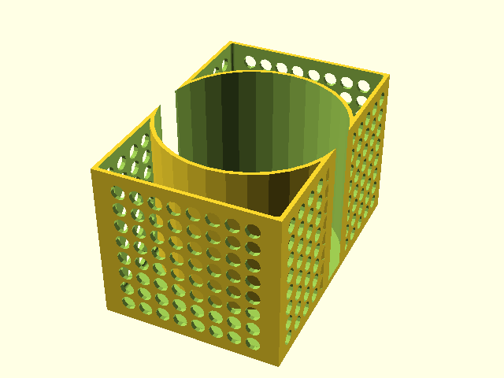
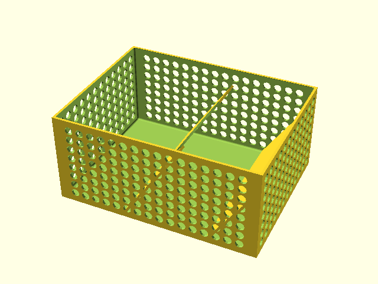
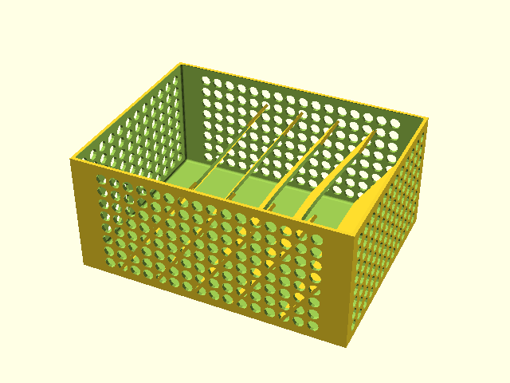
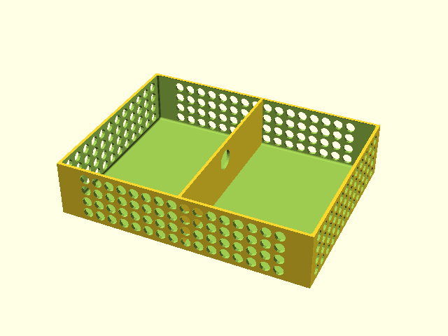

# Board Game Organizer System for 29x29 cm Box

Concept

 * Game Box divided into 9x3 cells (9 columns, 3 rows)
 * Cell width: 31 mm
 * Cell length: 94 mm (most game cards should fit)
 * Should fit for most board games with cards, shipped in 29x29 cm box
 * Each insert is a multiple of the cell width and height
 * The inserts are available in two heights: 56mm ("f"ull height) and 28mm ("h"alf height) 
 * The insert name contains two digits, first is the column cell multiplier, second the row cell multiplier
 * The size of the smallest insert is 31x94 mm (f11)
 
Design & Print

 * Mesh walls to save material
 * Not so think bottom (excption: Wiz War Life Tracker)
 * 0.4mm Nozzle, 0.2mm Layers, Infill 20%

## f11_plain

## f11_sep

## f11_2sep

## f11_3sep

## f21_sep

## f21_wiz_war_life_tracker

## f41_2slot

## f41_5slot

## h41_sep

