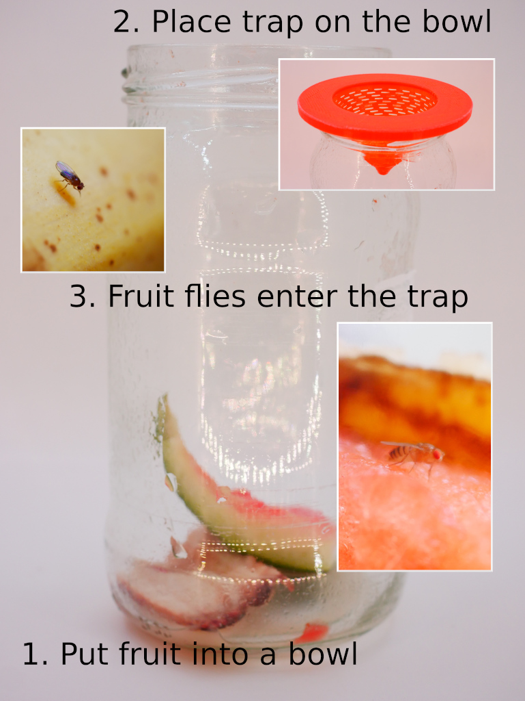

# Breezy Fruit Fly Tracp

A reliable trap for fruit flies:

 1. Put some fruit into a bowl, pot or similar
 2. Place the 3D printed trap on top of your bowl
 3. Wait until flies entered the trap
 4. Open the bowl outside and release the flies
 
3D Print: No support required, infill 30%, layer height 0.2mm (or 0.1mm)

