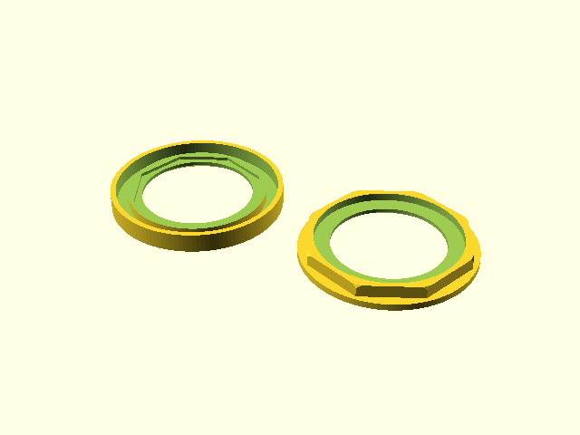

# Ikoria Keyword Counter Holder

 * Holder / Chip for MTG keyword counter introduced in Ikoria: Lair of the Behemoths 
      ([Ikoria: Lair of the Behemoths](https://magic.wizards.com/en/articles/archive/feature/ikoria-lair-behemoths-mechanics-2020-04-02))
 * Places a flat ring around the paper keyword counter
 * Protects the keyword counter
 * Better handling of the keyword counter
 * Easier to identify if additional colors are used during 3d print
 * Press fit connection (no glue required)
 * How to use:
    1. Place the Ikoria paper token into the inner octagon
    2. Put both parts together

"Ikoria Keyword Counter Holder" is unofficial Fan Content permitted under the Fan Content Policy. 
Not approved/endorsed by Wizards. Portions of the materials used are property of 
Wizards of the Coast. ©Wizards of the Coast LLC. (see [https://company.wizards.com/fancontentpolicy](https://company.wizards.com/fancontentpolicy))

