# Train Tube Track

"Train Tube Track" adds a movable thing (usually a train or railway engine) to a miniature diorama (https://en.wikipedia.org/wiki/Diorama).

This work is licensed under the Creative Commons Attribution-NonCommercial-ShareAlike 4.0 International License. To view a copy of this license, visit http://creativecommons.org/licenses/by-nc-sa/4.0/.

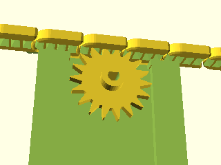

 * "Train Tube Track" contains multiple pieces (see below)
 * All parts are available as 3D printer STL files
 * Many different tracks can be created
 * "Train Tube Track" requires a DC Gear Motor. The motor holder is designed for a "N20 DC Gear Motor". Use 50 RPM version.
 * Some parts include holder for the Grove Toolset (https://www.seeedstudio.com): LED lights, DC Motor controller.
 * The "track" is actually a tube. The tube is filled with small "ships". The ships are moved forward by the DC Motor (see animation below)
 * One or more ships may carry (transport) the movable thing.

## Howto build a track?

Select the parts: This example uses simple circle together with the motor holder and a straight track.

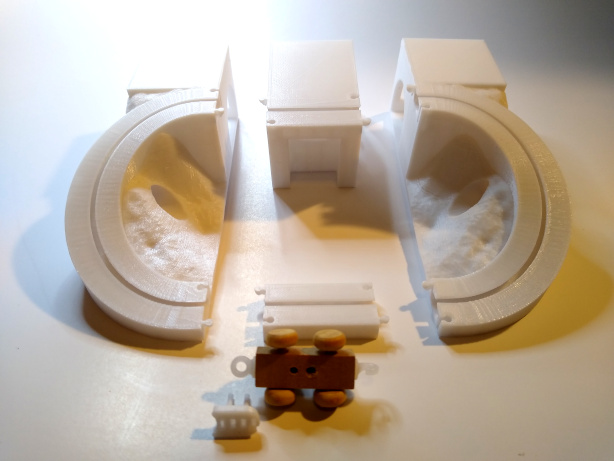

Before putting everything together, 
test whether the gear fits on the N20 DC motor shaft. 
If not, remove some material from the gear shaft hole.

Once done, remove the gear and put the N20 (55 RPM) DC motor into the holder. 
This can be a little bit tricky.

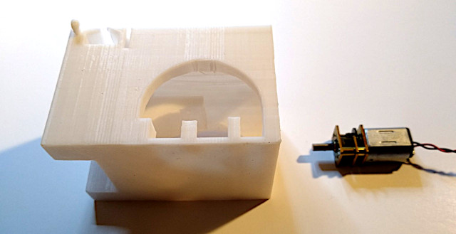

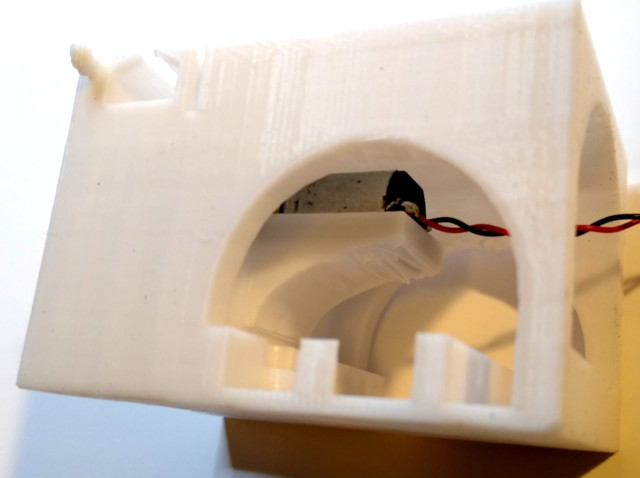

Add the gear to it (can be done later also)

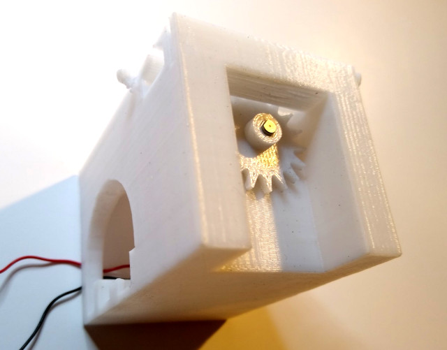

Use silicone grease for the tracks

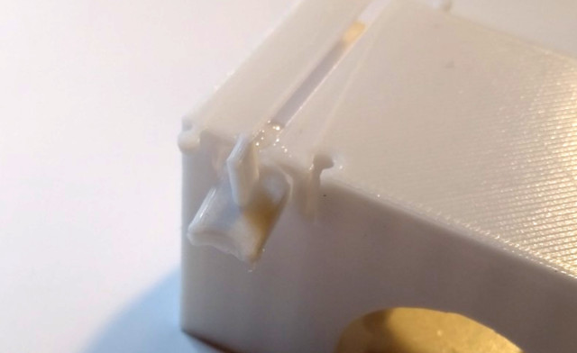

Also add silicone grease to all the ships. Basically all moving parts should
get some silicone grease.

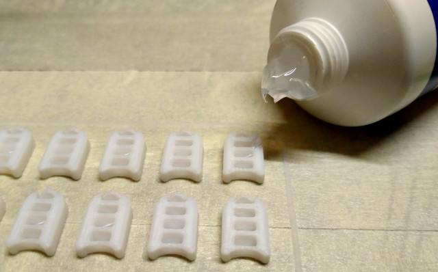

Put the track pieces together and insert the ships. Apply a voltage source to the N20 motor
to forward the ships while adding more ships to it. The complete tube must be filled with 
those little ships. In this example you need to add thee 3/4 ships. All other ships are 4/4 ships.

Here is a video of the assembled track:
<a href="https://raw.githubusercontent.com/olikraus/scad/master/train_tube_track/img/ttt_plain_circle_track.mp4">Video</a>

## Part Overview

3D Print:
 * All parts can be printed without "Support".
 * Infill 16% should be good enough
 * Unless otherwise noted, use "brim" 

| TTT Part | TTT Part |
|---|---|
| [stl/ttt_motor_holder_plain.stl](stl/ttt_motor_holder_plain.stl) 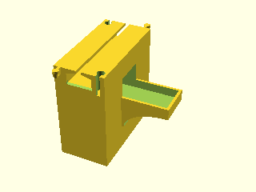 | [stl/ttt_motor_holder_grove.stl](stl/ttt_motor_holder_grove.stl) 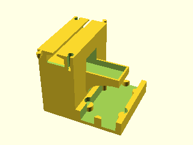 |
| [stl/ttt_motor_holder_grove_platform.stl](stl/ttt_motor_holder_grove_platform.stl) 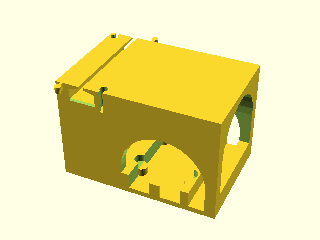 | [stl/ttt_gear.stl](stl/ttt_gear.stl): Can be printed with skirt or with brim    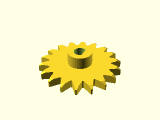 |
| [stl/ttt_ships_no_brim.stl](stl/ttt_ships_no_brim.stl): No "brim", just "skirt" 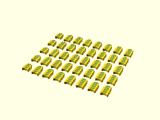 | [stl/ttt_transport_ship.stl](stl/ttt_transport_ship.stl): Use with "brim"! 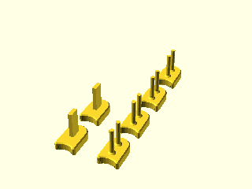 |
| [stl/ttt_straight_1.stl](stl/ttt_straight_1.stl) 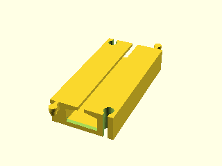 | [stl/ttt_high_straight_1.stl](stl/ttt_high_straight_1.stl) 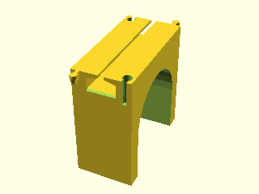 |
| [stl/ttt_straight_2.stl](stl/ttt_straight_2.stl) 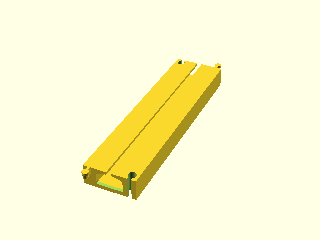 | [stl/ttt_high_straight_2.stl](stl/ttt_high_straight_2.stl) 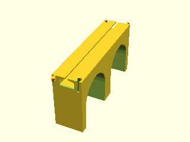 |
| [stl/ttt_curve90_1.stl](stl/ttt_curve90_1.stl) 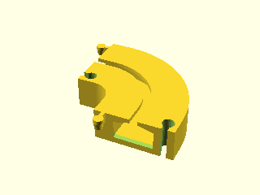 | [stl/ttt_curve180_2.stl](stl/ttt_curve180_2.stl) 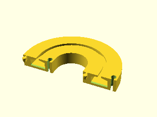 |
| [stl/ttt_curve180_ramp_3_led_platform.stl](stl/ttt_curve180_ramp_3_led_platform.stl) 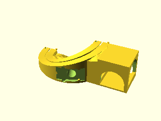 | [stl/ttt_curve180m_ramp_3_led_platform.stl](stl/ttt_curve180m_ramp_3_led_platform.stl) 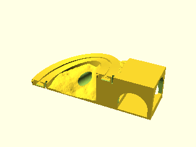 |
| [stl/ttt_curve180_ramp_3_led.stl](stl/ttt_curve180_ramp_3_led.stl) 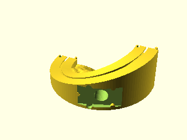 | [stl/ttt_curve180m_ramp_3_led.stl](stl/ttt_curve180m_ramp_3_led.stl) 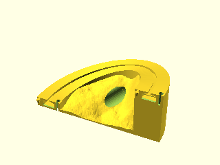 |
| [stl/ttt_curve180_ramp_3.stl](stl/ttt_curve180_ramp_3.stl) 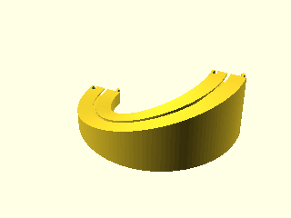 | [stl/ttt_curve180m_ramp_3.stl](stl/ttt_curve180m_ramp_3.stl) 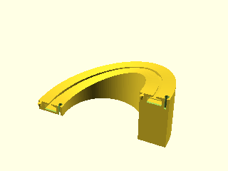 |

# Examples

